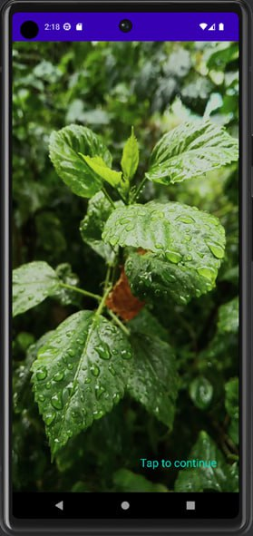
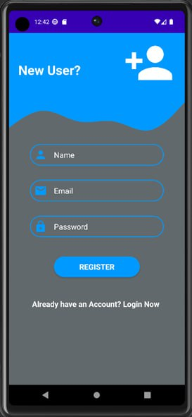
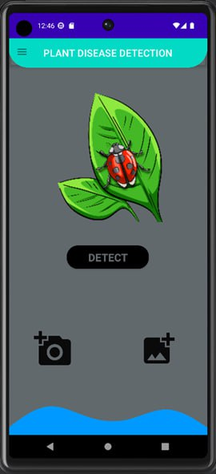
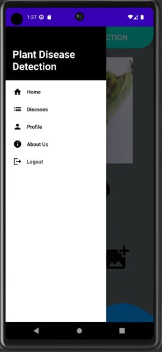
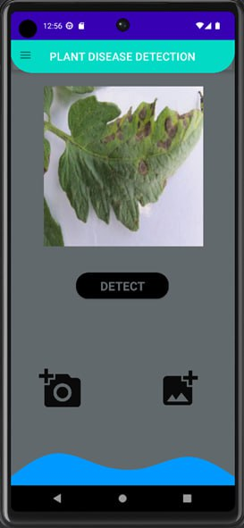
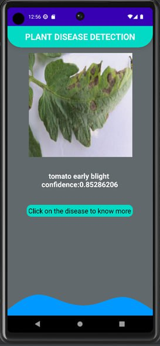
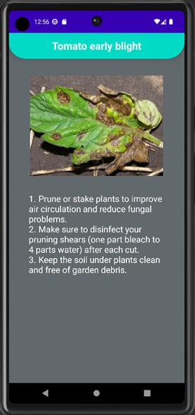
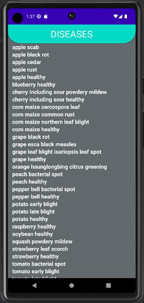
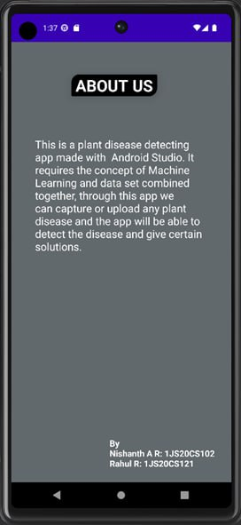

# Plant Disease Detection Android Application


## Overview

The **Plant Disease Detection** application is an Android app developed using Kotlin. It enables users to identify diseases in plants through image analysis using machine learning techniques. The app offers a user-friendly interface for capturing or selecting images, analyzing them, and providing solutions to detected diseases.

## Features

- **Image Analysis:** Capture images or select from gallery to analyze and detect crop diseases.
- **Machine Learning:** Utilizes TensorFlow Lite and machine learning models to classify diseases.
- **Suggested Solutions:** Provides suggested remedies or actions to mitigate detected diseases.
- **User Authentication:** Secure email and password authentication powered by Firebase.
- **Cloud Storage:** Store user data and analysis results in Firestore for easy access across devices.

## Technologies Used

- Kotlin programming language
- Android Studio IDE
- [TensorFlow Lite](https://www.tensorflow.org/lite) for machine learning 
- [Firebase Authentication](https://firebase.google.com/) for user management
- [Firestore](https://firebase.google.com/) for cloud-based data storage
- [Kaggle datasets](https://www.kaggle.com/datasets/vipoooool/new-plant-diseases-dataset) for training the machine learning model
- [Teachable Machine](https://teachablemachine.withgoogle.com/) for custom model training

## Installation

1. Clone the repository:
   ```bash
   git clone https://github.com/RAHUL-R10/MAD_mini_project.git
   ```
2. Open the project in Android Studio.
3. Build and run the app on an Android device or emulator.

## Screenshots













## Usage

1. Launch the app.
2. Capture a plant image using the camera or select an image from the gallery.
3. The app will analyze the image and identify any diseases.
4. View the disease detection result and suggested solutions.

## Contributing

Contributions are welcome! Please feel free to open issues or submit pull requests for improvements, bug fixes, or new features.

## License

This project is licensed under the [MIT License](LICENSE).


 
